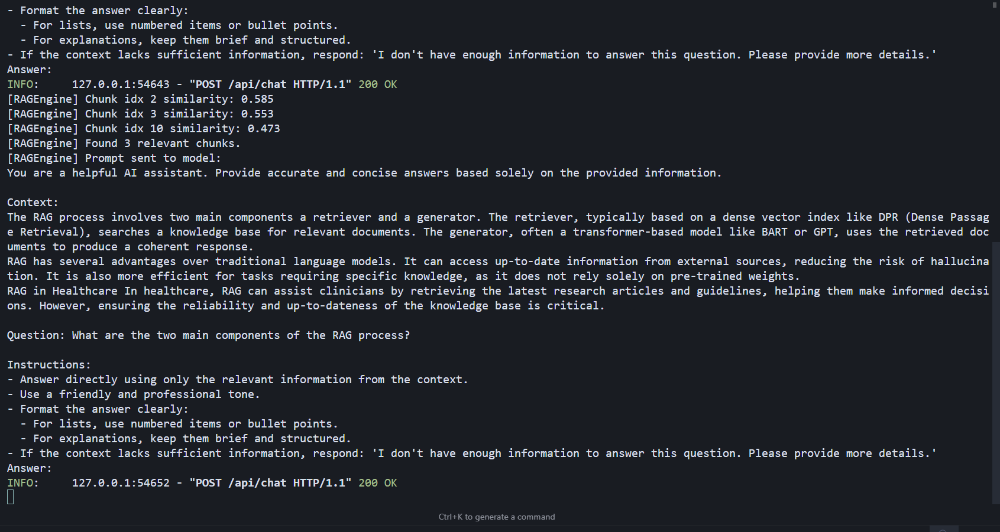

# RAG Chatbot – Retrieval-Augmented Generation System

A modern chatbot system that combines semantic retrieval and large language model (LLM) generation. Backend is built with Python FastAPI, using Together AI (Llama-3.3-70B-Instruct-Turbo-Free) for generation and all-MiniLM-L6-v2 for embeddings. Frontend is a beautiful React + Material UI app. Supports multi-turn chat, document upload, and optimized prompt engineering.

---

## 🛠️ Tech Stack

- **Backend:** Python 3.8+, FastAPI, python-dotenv
- **LLM API:** Together AI (Llama-3.3-70B-Instruct-Turbo-Free)
- **Embedding:** Sentence Transformers (all-MiniLM-L6-v2)
- **Vector Search:** NumPy, cosine similarity
- **Frontend:** React 18+, Material UI, Axios
- **File Upload:** FastAPI (backend), drag & drop (frontend)
- **Prompt Engineering:** Optimized for factual, concise, context-aware answers
- **Testing:** test_documents.txt, test_questions.txt

---

## 🚀 How It Works (RAG Mechanism)

```
User (React UI)
   │
   ▼
FastAPI Backend ──► [Document Upload → Chunking → Embedding (all-MiniLM-L6-v2) → Vector Store (NumPy)]
   │
   └─► [Query → Embedding → Top-k Retrieval → Prompt Construction → Together AI LLM → Response]
```

1. **Document Upload & Processing**
   - User uploads documents (.txt, .pdf, .docx, .md)
   - Documents are split into chunks (by paragraph)
   - Each chunk is embedded using all-MiniLM-L6-v2 (Sentence Transformers)
   - Embeddings are stored in memory (NumPy)

2. **Query & Retrieval**
   - User asks a question (chat interface)
   - The question is embedded
   - Cosine similarity is computed between the question and all document chunks
   - Top-3 most relevant chunks are selected as context

3. **Prompt Construction & Generation**
   - The context and question are combined into a carefully engineered prompt
   - Prompt is sent to Together AI (Llama-3.3-70B-Instruct-Turbo-Free)
   - The LLM generates a factual, context-aware answer
   - Multi-turn chat: full history is sent for context-aware dialogue

---

## 🧠 Models Used
- **Embedding Model:** `all-MiniLM-L6-v2` (Sentence Transformers)
  - Fast, high-quality semantic search
- **LLM (Generation):** `meta-llama/Llama-3.3-70B-Instruct-Turbo-Free` (Together AI)
  - State-of-the-art, instruction-tuned, cloud-hosted

---

## 🖥️ Demo

### 1. Upload File (Frontend)

*Frontend file upload interface: drag and drop, file selection, progress display.*

### 2. Upload File (Terminal Backend)

*Terminal log when file is successfully uploaded to the backend.*

### 3. Chat Q1 (Frontend)

*Chat interface: first question, RAG answer displayed.*

### 4. Chat Q1 (Terminal Backend)

*Backend log when receiving and processing the first question.*

### 5. Chat Q2 (Frontend)

*Chat interface: second question, RAG answer displayed.*

### 6. Chat Q2 (Terminal Backend)

*Backend log when receiving and processing the second question.*

---

## 🏆 Skills & Knowledge Gained
- **Retrieval-Augmented Generation (RAG) architecture**
- **Semantic search with embeddings**
- **Prompt engineering for LLMs**
- **Multi-turn conversational AI**
- **FastAPI backend, React + Material UI frontend**
- **File upload, chunking, and vector search**
- **Integration with cloud LLM APIs (Together AI)**
- **Error handling, scalability, and best practices**

---

## 🛠️ Setup Instructions

### Backend
```bash
cd api
python -m venv venv
source venv/bin/activate  # or .\venv\Scripts\activate on Windows
pip install -r requirements.txt
# Add your Together API key to .env:
echo TOGETHER_API_KEY=your_key_here > .env
python server.py
```
Server runs at http://localhost:8000

### Frontend
```bash
cd frontend
npm install
npm start
```
Frontend runs at http://localhost:3000

---

## 🔗 API Endpoints

### POST `/api/chat`
- **Request:**
  ```json
  { "history": [ {"role": "user", "content": "..."}, ... ] }
  ```
- **Response:**
  ```json
  { "response": "..." }
  ```

### POST `/api/upload`
- **Request:**
  - Form-data: `file` (txt, pdf, docx, md)
- **Response:**
  ```json
  { "message": "File 'xxx' uploaded and added to knowledge base." }
  ```

---

## 📂 Project Structure
```
RAG_chatbot/
├── api/
│   ├── models.py         # Model management (Together AI, embedding)
│   ├── rag_engine.py     # RAG logic (chunking, search, prompt)
│   ├── server.py         # FastAPI server
│   ├── requirements.txt  # Python dependencies
│   ├── test_documents.txt    # Test document set for RAG
│   ├── test_questions.txt    # Test question set for RAG
│   └── ...
├── frontend/
│   ├── src/
│   │   └── App.js        # Main React chat UI
│   ├── package.json      # Frontend dependencies
│   └── ...
└── README.md
```
- **Test files:**
  - `test_documents.txt`: Example knowledge base for testing retrieval and generation
  - `test_questions.txt`: Example questions for automated/manual RAG evaluation

---

## 🛡️ Troubleshooting
- **API key error:** Ensure `.env` contains `TOGETHER_API_KEY=...` and python-dotenv is installed.
- **Model/embedding errors:** Check internet connection for model downloads on first run.
- **CORS issues:** FastAPI is configured for all origins by default; adjust in `server.py` if needed.
- **Frontend/backend connection:** Make sure both servers are running and URLs match.

---

## 🙏 Credits
- [Together AI](https://together.ai/) for LLM API
- [Sentence Transformers](https://www.sbert.net/) for embeddings
- [Material UI](https://mui.com/) for frontend components


